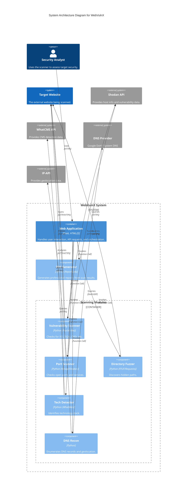

# System Architecture Diagram

```mermaid
C4Context
    title System Architecture Diagram for WebVulnX

    Person(user, "Security Analyst", "Uses the scanner to assess target security.")
    System(target, "Target Website", "The external website being scanned.")

    System_Boundary(webvulnx, "WebVulnX System") {
        Container(webapp, "Web Application", "Flask, HTML/JS", "Handles user interaction, API requests, and orchestration.")
        
        Container_Boundary(scanners, "Scanning Modules") {
            Component(vuln_scan, "Vulnerability Scanner", "Python (Nuclei-like)", "Checks for XSS, SQLi, CVEs, etc.")
            Component(port_scan, "Port Scanner", "Python (Nmap/Shodan)", "Checks open ports and services.")
            Component(dir_fuzz, "Directory Fuzzer", "Python (FFUF/Requests)", "Discovers hidden paths.")
            Component(tech_detect, "Tech Detector", "Python (WhatWeb)", "Identifies technology stack.")
            Component(dns_recon, "DNS Recon", "Python", "Enumerates DNS records and geolocation.")
        }

        Component(pdf_gen, "PDF Generator", "Python (ReportLab)", "Generates professional reports from scan results.")
    }

    System_Ext(shodan, "Shodan API", "Provides host info and vulnerability data.")
    System_Ext(whatcms, "WhatCMS API", "Provides CMS detection data.")
    System_Ext(dns_provider, "DNS Provider", "Google DoH / System DNS", "Resolves domain records.")
    System_Ext(ip_api, "IP-API", "Provides geolocation data.")

    Rel(user, webapp, "Uses", "HTTPS")
    Rel(webapp, vuln_scan, "Invokes", "Function Call")
    Rel(webapp, port_scan, "Invokes", "Function Call")
    Rel(webapp, dir_fuzz, "Invokes", "Function Call")
    Rel(webapp, tech_detect, "Invokes", "Function Call")
    Rel(webapp, dns_recon, "Invokes", "Function Call")
    Rel(webapp, pdf_gen, "Invokes", "Function Call")

    Rel(vuln_scan, target, "Scans", "HTTP/HTTPS")
    Rel(vuln_scan, shodan, "Queries", "HTTPS")
    
    Rel(port_scan, target, "Probes", "TCP/IP")
    Rel(port_scan, shodan, "Queries", "HTTPS")

    Rel(dir_fuzz, target, "Fuzzes", "HTTP/HTTPS")
    
    Rel(tech_detect, target, "Analyzes", "HTTP/HTTPS")
    Rel(tech_detect, whatcms, "Queries", "HTTPS")

    Rel(dns_recon, dns_provider, "Queries", "DoH/UDP")
    Rel(dns_recon, ip_api, "Queries", "HTTPS")
```
