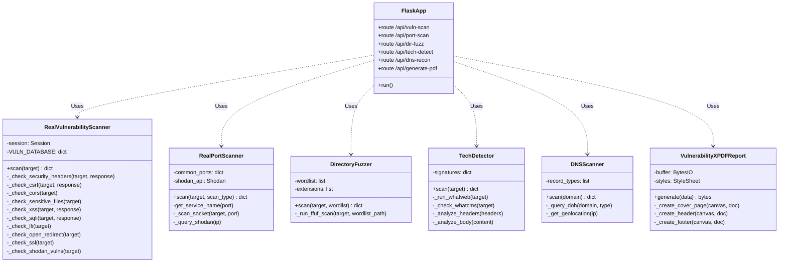

# UML Class Diagrams

```mermaid
classDiagram
    class FlaskApp {
        +route /api/vuln-scan
        +route /api/port-scan
        +route /api/dir-fuzz
        +route /api/tech-detect
        +route /api/dns-recon
        +route /api/generate-pdf
        +run()
    }

    class RealVulnerabilityScanner {
        -session: Session
        -VULN_DATABASE: dict
        +scan(target) dict
        -_check_security_headers(target, response)
        -_check_csrf(target, response)
        -_check_cors(target)
        -_check_sensitive_files(target)
        -_check_xss(target, response)
        -_check_sqli(target, response)
        -_check_lfi(target)
        -_check_open_redirect(target)
        -_check_ssl(target)
        -_check_shodan_vulns(target)
    }

    class RealPortScanner {
        -common_ports: dict
        -shodan_api: Shodan
        +scan(target, scan_type) dict
        -get_service_name(port)
        -_scan_socket(target, port)
        -_query_shodan(ip)
    }

    class DirectoryFuzzer {
        -wordlist: list
        -extensions: list
        +scan(target, wordlist) dict
        -_run_ffuf_scan(target, wordlist_path)
    }

    class TechDetector {
        -signatures: dict
        +scan(target) dict
        -_run_whatweb(target)
        -_check_whatcms(target)
        -_analyze_headers(headers)
        -_analyze_body(content)
    }

    class DNSScanner {
        -record_types: list
        +scan(domain) dict
        -_query_doh(domain, type)
        -_get_geolocation(ip)
    }

    class VulnerabilityXPDFReport {
        -buffer: BytesIO
        -styles: StyleSheet
        +generate(data) bytes
        -_create_cover_page(canvas, doc)
        -_create_header(canvas, doc)
        -_create_footer(canvas, doc)
    }

    FlaskApp ..> RealVulnerabilityScanner : Uses
    FlaskApp ..> RealPortScanner : Uses
    FlaskApp ..> DirectoryFuzzer : Uses
    FlaskApp ..> TechDetector : Uses
    FlaskApp ..> DNSScanner : Uses
    FlaskApp ..> VulnerabilityXPDFReport : Uses
```
